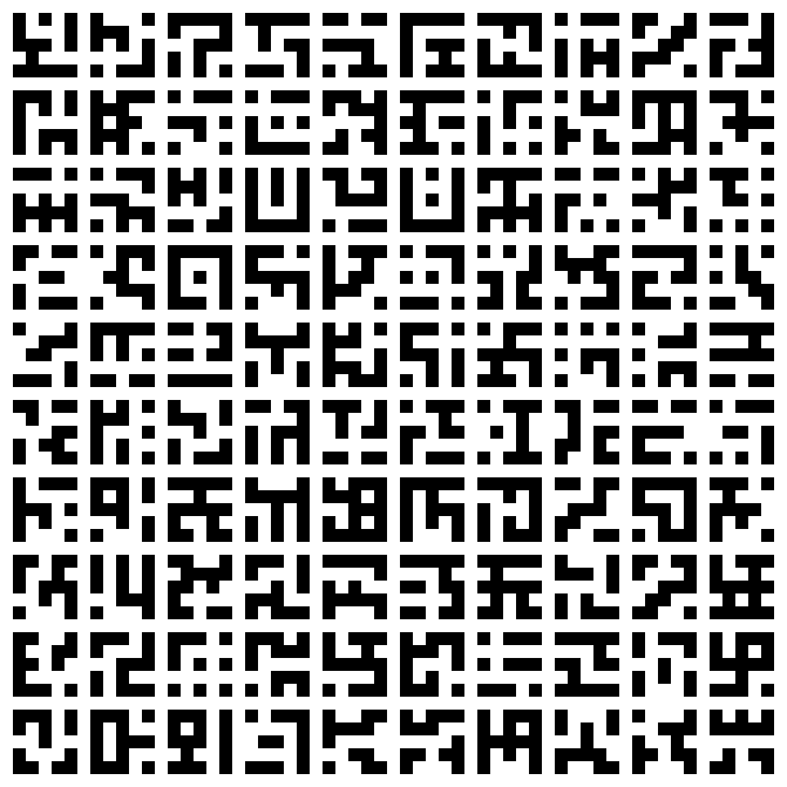
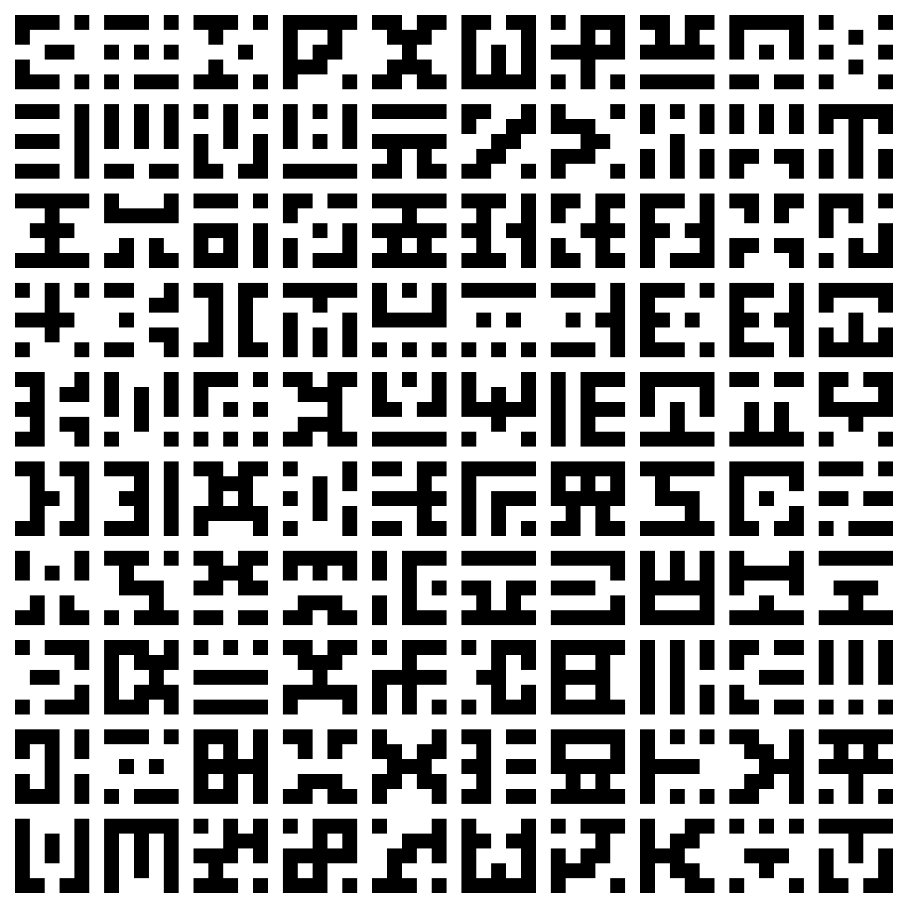

# Pixelart Glyph Creator

A simple pixelart glyph creator, allowing to create arbitrary size glyphs with arbitrary size blacklist and whitelist
kernel rules. Allows for extra symmetry rules to not make asymmetric glyphs.

Does things in 3 steps:

1. Run `create_glyph_db.py` to create an SQLite database in `dbs/` based on the defined rules (all renders use default
   rules).
2. Run `render_glyphs_from_db.py` to create a filestructure with all the glyphs rendered as png images, sorted by
   folders based on the aesthetic score which is the sum of how many types of symmetries it fulfills.
3. Run `render_grid_from_images.py` to render these grids of glyphs that you see.

For example, with the defaults present, the initial 2^25 possible glyphs are cut down to 29k. 27k of them don't have any
symmetry and thus fall into the score 0 bucket, the other 2k are nice and "clean". Some nice looking glyphs still exist
with a score of 0, it's just that they're a lot harder to find, they're likely to be remembered as "The clean glyph X
but slightly off", so at that point might as well just use the original clean one. Here's a small comparison table of
the grid of random glyphs rendered if the completely asymmetric ones are excluded or included:

| Asymmetric Included                      | Asymmetric Excluded                     |
|------------------------------------------|-----------------------------------------|
|  |  |

As you can see, the ones on the left are a lot more random, while the ones on the right are a lot more structured.

The default rules are set to:

1. Create 5x5 glyphs
2. Blacklist a glyph from having a 2x2 white space
3. Blacklist a glyph from having a 2x2 black space
4. Blacklist pixels from touching only on the diagonal
5. Whitelist the glyphs corners to be white (each glyph's corners must be filled)
6. No symmetry checks, all 29k are created in the database

The default glyphs are good for games, primarily for UI icons or status effect symbols, but they also work quite well
for conlangs or ciphers. The 2k clean looking glyphs means that you could even transcribe about 95% of the most common
Chinese characters, and dip into the asymmetric ones for the unique usecases. But of course you can edit the generation
rules to make even more, or less, or a different size or with different aesthetic rules.

Have fun!
