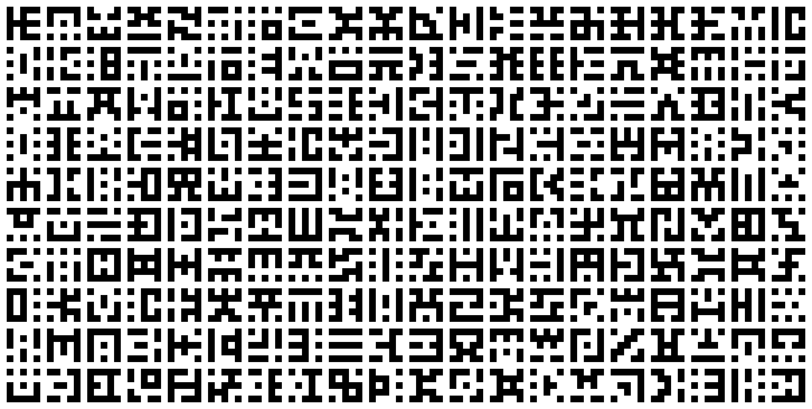
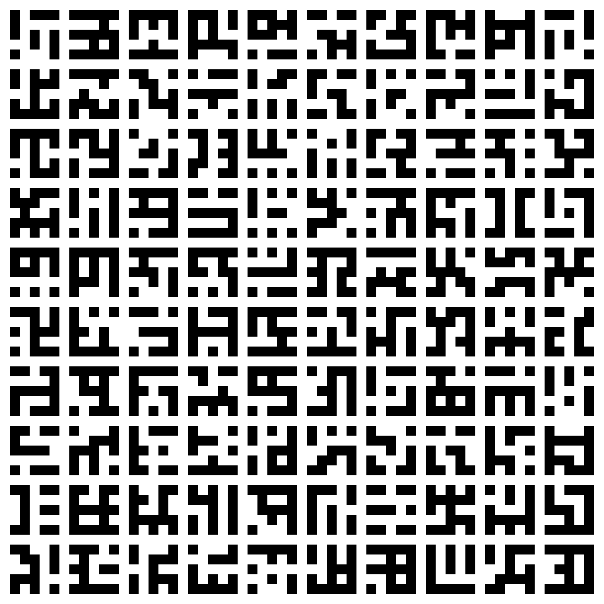
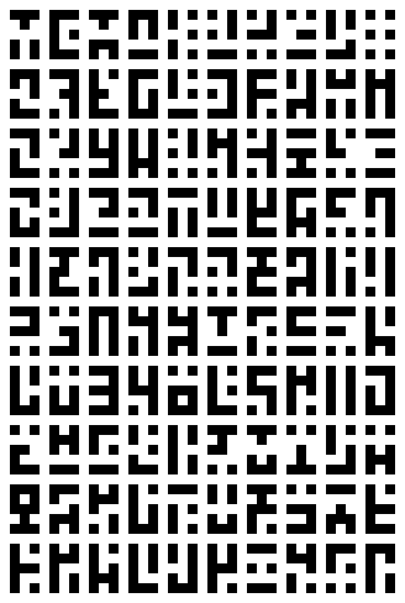
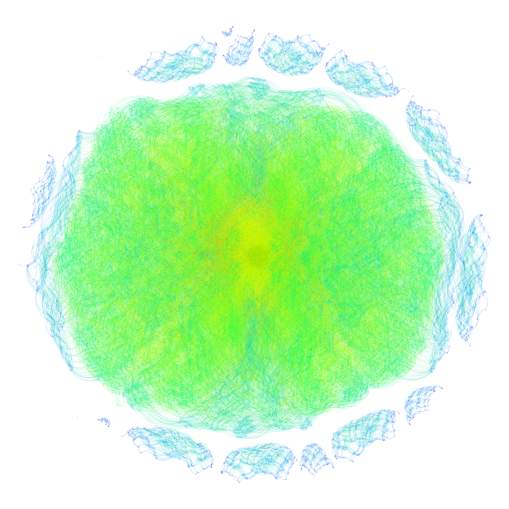
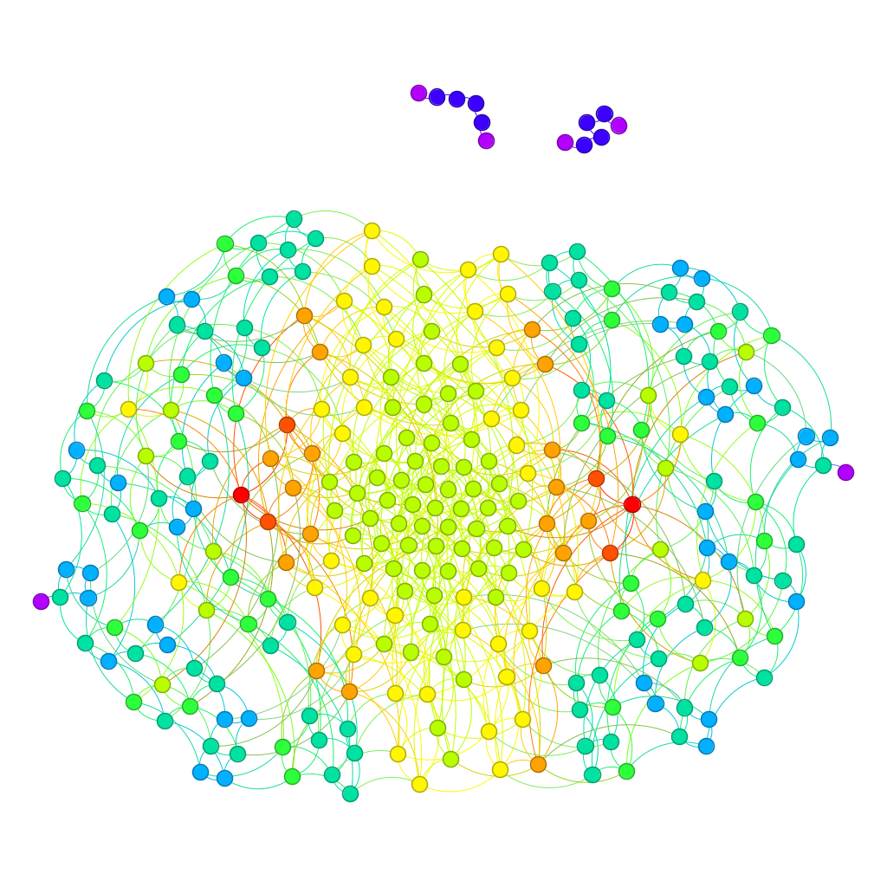
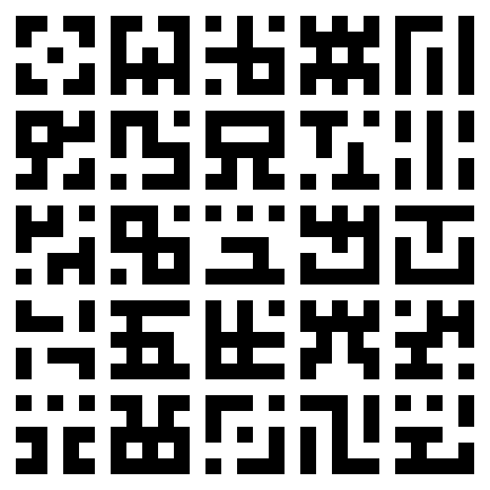

# Pixelart Glyph Creator

A comfortable, browser-based workshop for generating coherent families of binary pixel-art glyphs. Define the parts
every glyph shares, forbid patterns you dislike, require motifs you want, and export every valid result in one ZIP.

**[Open Pixelart Glyph Creator](https://yegor-men.github.io/pixelart-glyph-creator/)**

The application is completely client-side: generation, previewing, PNG rendering, graph construction, and ZIP creation
all happen on your device. Nothing is uploaded, and there is no account, backend, installation, or build step.

## What you can control

- Resize the glyph template from 1×1 through 10×10.
- Mark template cells as flexible, always filled, or always empty.
- Add, duplicate, resize, edit, and remove blacklist or whitelist kernels.
- Preview an evenly distributed sample of the valid glyphs.
- Choose PNG scale, margin, ink colour, paper colour, and archive name.
- Export and import configurations as JSON.
- Render the complete valid set with live progress and immediate cancellation.

Your current configuration is saved automatically in the browser.

## The rule model

Every template and kernel is a matrix containing three possible values:

| Value | In the template | In a kernel |
|---:|---|---|
| `1` | This pixel must be filled. | The matched pixel must be filled. |
| `0` | This pixel must be empty. | The matched pixel must be empty. |
| `-1` | This pixel is flexible. | This pixel is ignored—a wildcard. |

The three rule groups have different jobs:

1. **Template:** establishes the glyph dimensions and fixes pixels shared by every result.
2. **Blacklist:** rejects a glyph if any blacklisted kernel matches anywhere inside it.
3. **Whitelist:** when at least one whitelist kernel exists, keeps a glyph only if one or more of those kernels matches.

Whitelist kernels use **OR** semantics, not AND: a glyph does not need to contain every whitelisted pattern. Kernels are
never wrapped or clipped; a match is considered only where the entire kernel fits inside the glyph.

## How glyph generation works

Suppose the template contains `F` flexible cells. Those cells describe `2^F` possible bit patterns. Fixed template
cells do not create branches, so locking even a few cells can reduce the search dramatically.

The generator processes that search as follows:

1. The template is flattened in row-major order: left to right, then top to bottom.
2. Every legal placement of every kernel is precomputed. A placement records which glyph cells it checks and the index
   of its final cell in row-major order.
3. A depth-first search assigns each flexible cell first to `0`, then to `1`. Fixed cells are copied directly from the
   template.
4. As soon as the search reaches the final cell covered by a blacklist placement, that placement is tested. If it
   matches, the entire remaining branch is rejected immediately. There is no need to construct all of its leaves.
5. At a complete candidate, whitelist placements are checked. An empty whitelist passes automatically; otherwise at
   least one placement must match.
6. A surviving candidate becomes a bitstring such as `010110...`. The generator also records its number of filled
   cells and its count of orthogonally connected filled components.
7. Once enumeration finishes, each bitstring is rendered as a compact one-bit indexed PNG. The exporter then builds
   metadata and a graph connecting glyphs that differ by exactly one bit.

The progress bar remains accurate when blacklist pruning skips a branch. A skipped branch represents
`2^(remaining flexible cells)` completed assignments, so the processed count advances by that amount instead of only
counting leaves that were explicitly visited.

The upper-bound enumeration cost is exponential in the number of flexible cells. Blacklists can make a run much
faster, but they cannot make an enormous unconstrained template predictable. The interface asks for confirmation above
10 million theoretical assignments and disables runs above 268 million until more template cells are fixed.

## Export format

**Render & download** creates a ZIP containing one top-level folder:

```text
pixelart-glyphs-4x4/
  glyphs/           # One PNG per glyph, named by its row-major bitstring
  metadata.csv      # bitstring,width,height,filename
  nodes.csv         # Gephi-compatible glyph nodes
  edges.csv         # Undirected one-bit-flip neighbours
  settings.json     # Exact configuration and run summary
  README.txt        # A short description of the archive
```

`nodes.csv` records each glyph's filled-cell and connected-component counts. `edges.csv` contains each undirected edge
once, with a weight of `1`. Import the two files into Gephi with **File → Import spreadsheet** to explore the generated
glyph space as a graph.

## Run locally

Clone the repository, serve its root as static files, and open the local URL:

```bash
git clone https://github.com/Yegor-men/pixelart-glyph-creator.git
cd pixelart-glyph-creator
python3 -m http.server 8000
```

Then visit <http://localhost:8000>. Opening `index.html` directly through `file://` is not supported because browsers
restrict Web Workers on local files. Python is only being used here as a convenient static file server; the application
itself is JavaScript and requires no Python packages.

Any other static server works as well, for example `npx serve .`.

## Project structure

```text
index.html            Page structure and accessible controls
styles.css            Responsive visual design
app.js                 UI state, editing, progress, previews, and ZIP orchestration
generator.worker.js    Background enumeration, filtering, and glyph statistics
exporter.js            Compact indexed-PNG encoding helpers
vendor/fflate.min.js   Vendored compression library
media/                 README examples and project artwork
AGENTS.md              Architecture and contribution guidance for coding agents
```

The project intentionally uses plain HTML, CSS, and JavaScript with no compilation step. Relative asset URLs allow the
same files to work locally and under the `/pixelart-glyph-creator/` GitHub Pages project path.

## Examples

With filled corners and the default blacklist, the generator produces 29,130 valid 5×5 glyphs and 294 valid 3×5
glyphs.

| 5×5 glyph grid | 3×5 glyph grid |
|---|---|
|  |  |

| 5×5 neighbour graph | 3×5 neighbour graph |
|---|---|
|  |  |

These sets work well for game UI icons, status effects, conlangs, ciphers, and any project that needs a related family
of small symbols.



## Browser dependency

The repository vendors [fflate](https://github.com/101arrowz/fflate) 0.8.2 so PNG and ZIP compression work locally and
without a CDN. Its MIT license is included in `vendor/fflate.LICENSE.txt`. Do not remove `vendor/` unless the compression
implementation is replaced.
